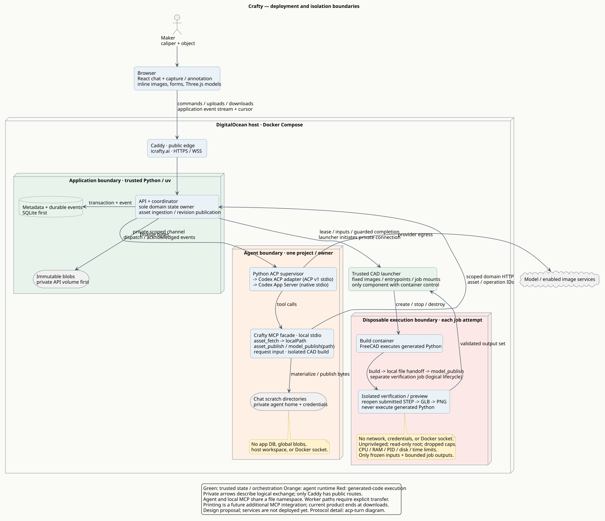

# Crafty architecture

The [PRD](../PRD.md) describes product behavior and outcomes. The
[TRD](../TRD.md) records technical decisions with its own TRD-1-based counter.
[M-CAD.md](../M-CAD.md) specifies the CAD evaluator's file contract and acceptance.
These diagrams illustrate the TRD's confirmed direction and proposed details;
they do not represent running application services. The
[decision index](ASSUMPTIONS.md) maps earlier assumption identifiers to the TRD.

- [Deployment and isolation](rendered/overview.svg) · [PlantUML](overview.puml) · [PNG](rendered/overview.png)
- [ACP conversation and local file handoff](rendered/acp-turn.svg) · [PlantUML](acp-turn.puml) · [PNG](rendered/acp-turn.png)
- [Images and annotation lineage](rendered/assets.svg) · [PlantUML](assets.puml) · [PNG](rendered/assets.png)
- [CAD rendering and verification loop](rendered/models.svg) · [PlantUML](models.puml) · [PNG](rendered/models.png)
- [Per-session containers and recovery](rendered/sessions.svg) · [PlantUML](sessions.puml) · [PNG](rendered/sessions.png)
- [Turn cancellation and recovery](rendered/turns.svg) · [PlantUML](turns.puml) · [PNG](rendered/turns.png)
- [ACP implementation notes and first integration checks](ACP.md)

## CAD review

Start with [M-CAD.md](../M-CAD.md) and these focused schematics:

- [Core file contract](rendered/cad-contract.svg) · [PlantUML](cad-contract.puml) · [PNG](rendered/cad-contract.png)
- [Development and fixture progression](rendered/cad-development.svg) · [PlantUML](cad-development.puml) · [PNG](rendered/cad-development.png)
- [MCP file handoff](rendered/cad-handoff.svg) · [PlantUML](cad-handoff.puml) · [PNG](rendered/cad-handoff.png) · [Protocol](CAD-PROTOCOL.md)

The core diagram shows geometry ensure/reuse, requested evidence, and annotation
outputs. M-CAD-37–42 describe the local Makefile/Rich verification harness shown
in the development diagram. The wrapper diagram shows
how local files cross isolation boundaries while preserving that contract. These
are review drafts; the [CAD package](../../cad/README.md) is currently a uv scaffold.
Full ACP and session diagrams are background for this module review. See the
[documentation index](../README.md) for other reading paths.

## Rendering

From the project root, `make diagrams` or `make architecture` renders SVG and PNG files.
`make diagrams-check` checks PlantUML syntax. `make diagrams-svg`,
`make diagrams-png`, and `make diagrams-clean` operate on those outputs separately.
Inside this directory, use `make`, `make svg`, `make png`, `make check`, or `make clean`.

Rendering requires Make, a recent PlantUML CLI supporting the long options in the
Makefile, Java, and Graphviz. Override `PLANTUML` if needed, for example
`make diagrams PLANTUML='java -jar /path/to/plantuml.jar'`.
Generated renders live beside the sources in `rendered/`.
The commands use the local renderer; diagrams are not submitted to a rendering service.
See the [PlantUML command-line reference](https://plantuml.com/command-line).

Python application and integration tooling will use `uv`; rendering itself does
not require Python. The original idea document is preserved.
