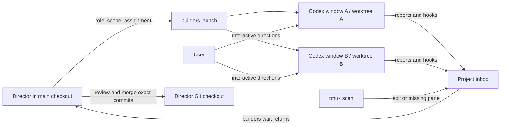

# Project-local Codex builders

Read [ROLES.md](ROLES.md) for director and worker responsibilities. Shared project
context and conventions live in the root [AGENTS.md](../AGENTS.md), ready to fill
in as the project develops. This folder owns the workflow's tools and process.

The director works in the main checkout. Narrow, persistent workers run interactive
Codex in separate Git worktrees and tmux windows in **`crafty-builders`**. The user
can enter any window and give directions. A single durable inbox returns their
reports, questions, lifecycle events, and failures to the director. The director
reviews and merges accepted commits into its own checkout.



## Setup and locality

Requirements: Linux/macOS, Git, tmux, uv, Python 3.11+, and an authenticated Codex
CLI. `workflow/tools/builders.py` has PEP 723 inline metadata, with `dependencies = []`;
the implementation uses the standard library. The `./workflow/builders` wrapper, tmux
supervisors, watcher, and Codex callbacks all use `uv run --script`. uv's cache
is inside `.builders/uv-cache`. There is no package installation or service setup.
See [uv's script documentation](https://docs.astral.sh/uv/guides/scripts/).

Run the examples below from the project root. The root `./builders` command
remains a shortcut for `./workflow/builders`.

From the main checkout:

```bash
./workflow/builders init
./workflow/builders doctor
./workflow/builders monitor
```

`init` is idempotent. It saves configuration in `.builders/config.json` and adds
runtime-file exclusions to this repository's `.git/info/exclude`. It never edits
`~/.codex/config.toml`, `~/.tmux.conf`, shell startup files, or global Git config.
Codex still uses your existing authentication and model preferences. Worker
launches explicitly select `workspace-write` with `on-request` approvals.

If `codex` on your PATH is an npm update wrapper, select an already installed
executable at initialization to avoid network-dependent startup:

```bash
./workflow/builders init --codex-bin /absolute/path/to/codex
```

The executable path is local machine state, not committed configuration. To
change it after initialization, stop workers and edit `codex_bin` in
`.builders/config.json`. Existing `init` calls do not overwrite configuration.

Before the first launch, **commit the project baseline**. A Git repository with
no commits cannot create worker branches. Launches start from the director's
current committed `HEAD`; uncommitted files are not copied into worktrees. Include
any specifications, interfaces, or fixtures that workers need in that baseline.
Initialization and launch never automatically stage or commit the director's files.

Layout:

| Path | Purpose |
| --- | --- |
| `workflow/builders` | Canonical uv launcher (`builders` at the root forwards here) |
| `workflow/tools/builders.py` | CLI, hooks, supervisor, scanner, and inbox |
| `AGENTS.md` | Shared project context and conventions |
| `workflow/ROLES.md` | Director and worker process |
| `workflow/README.md` | Operating guide |
| `workflow/tests/` | Isolated integration tests |
| `.builders/config.json` | Project session, executable, and director branch |
| `.builders/state.sqlite3` | Workers, append-only events, and consumer cursors |
| `.builders/workers/NAME/assignment.md` | Current role, scope, task, and reporting command |
| `.builders/workers/NAME/assignment-N.md` | Assignment history |
| `.worktrees/NAME/` | Worktree on `builders/crafty-builders/NAME` |

Each worker has an ignored `AGENTS.override.md` symlink to the director's
`AGENTS.md`. The canonical file is live and shared; no tracked worker file is
replaced. Worker prompts separately point to this bundle's `workflow/ROLES.md`.
Workers re-read both documents at assignment boundaries and after compaction.
With `--root` pointing to another repository, project context comes from that
repository and the role guide still comes from this workflow bundle.
If the project already tracks an `AGENTS.override.md`, consolidate those
instructions into `AGENTS.md` before using this launcher.

## Delegate narrow work

Choose a stable role and disjoint owned paths. State the interface, expected
behavior, validation, and what counts as complete in the prompt. Use a prompt file
for longer assignments. The following are examples, not tasks launched by setup:

```bash
./workflow/builders launch api-health \
  --role 'Backend health endpoint owner' \
  --scope backend/health.py --scope backend/tests/test_health.py \
  --prompt 'Implement GET /health returning {"status":"ok"}. Add a focused test. Report validation and commit the result.'

./workflow/builders launch ui-status \
  --role 'Frontend status indicator owner' \
  --scope frontend/src/components/Status.tsx \
  --prompt-file /tmp/ui-status-task.md
```

Launch immediately returns worker metadata, including its pane ID and worktree.
The first launch creates a `monitor` window when the session does not exist;
`./workflow/builders monitor` can create it ahead of time. The existing director agent
stays in its original conversation/checkout; the monitor is a watcher, not another
director agent.

Workers receive their role, scope, assignment generation, common instructions,
and exact reporting command at startup. A role persists across assignments.
Directory prefixes and glob patterns are accepted for `--scope`; repeat the flag
for several entries. Scope is a coordination and merge check, not filesystem
access isolation. Workers share the Git object database and coordination state.

## Visit and steer a worker

```bash
tmux attach-session -t crafty-builders
./workflow/builders attach api-health
./workflow/builders steer api-health --prompt 'Keep the response schema unchanged; add the timeout case to validation.'
```

`attach` selects the worker from inside tmux, or attaches from an ordinary terminal.
Use tmux's window selector (`Ctrl-b w` by default) to move between workers.
`steer` pastes literal text into the owned live Codex pane and submits it. Codex
may queue it during an active turn. It does not press approval buttons or cancel
an in-progress tool. Avoid submitting through the CLI while you are editing a
draft in that same worker's input field.

When trusted hooks are active, direct TUI prompts are recorded in the central
inbox and invalidate an older completion report. Workers also report scope
changes to the director. Use `steer` for revisions to the current assignment;
use `assign` after integration for the next assignment.

## Reporting and waking the director

Workers run the exact command supplied in `assignment.md`. For example, from
the director checkout the equivalent command is:

```bash
./workflow/builders report api-health --generation 1 --status done \
  --summary 'Added the health endpoint and timeout handling.' \
  --tests 'Targeted health tests passed.'
```

Available report statuses are `progress`, `blocked`, `error`, and `done`. A blocked
report should contain the exact decision or dependency needed. A done report
requires a clean worker checkout and captures the branch's exact commit, changed
paths, scope violations, summary, and validation. Reports from an old assignment
generation are rejected.

The director runs this as a **background shell tool call**:

```bash
./workflow/builders wait --timeout 60
```

For a Codex shell tool, start it with a short initial yield (for example
`yield_time_ms: 1000`), retain the returned process/session ID, and continue useful
work. Poll that process with the shell tool's continuation function. `wait`
returns JSON as soon as an attention event exists. It runs the scanner itself,
so it also works if the monitor window is gone. Without `--timeout`, it waits
indefinitely; a timeout exits with code **124**. Ordinary success is **0** and
command failures are **1**.

```bash
./workflow/builders inbox
./workflow/builders status
./workflow/builders inspect api-health
./workflow/builders diff api-health
./workflow/builders ack 42
```

Reading does **not** acknowledge events. Handle every event in a returned batch,
then acknowledge its `through` ID (replace `42` with the actual ID). A report
that arrives before `wait` starts is still delivered, and restarting the director
does not lose pending reports. `--consumer NAME` gives independent readers their
own cursors. `--after ID` reads from an explicit point without changing a cursor.
`inbox --all --after 0` includes informational history. Batches contain at most
100 events; continue reading after the last returned ID for more.

`./workflow/builders watch` continuously prints JSONL events and scans panes. `scan` runs
one pass and `status` runs a pass before returning workers. Nothing injects keys
into the director's terminal: the returning background tool call wakes it.
Run `./workflow/builders monitor` again to recover a stopped or missing watcher; it does
not duplicate an already-running project watcher.

## Hooks and fallback detection

Current Codex supports lifecycle hooks. The launcher supplies these through
per-invocation `-c` overrides; it installs no global or project `.codex` config:

| Hook | Builder behavior |
| --- | --- |
| `SessionStart` | Record the Codex thread ID and hook availability |
| `UserPromptSubmit` | Record directions and invalidate an older result |
| `PermissionRequest` | Notify the director that the worker needs approval |
| `Stop` | Record the last response; wake the director if no terminal report exists |
| `Interrupt` | Record the interruption and request attention |
| `SessionEnd` | Record session end |

All handlers are advisory and return `{}`. They do not approve commands, block
stops, or force another model turn. Native `Stop` and legacy `notify` callbacks
are deduplicated by worker run, thread, and turn once a root lifecycle hook has
verified the worker's thread. Child-agent hooks are ignored. A stopped turn is
**not** proof of completed work: only an explicit done report makes a worker
mergeable.

New hook definitions may require review with **`/hooks`** in the worker's Codex
UI. Codex may also ask you to trust the project at first launch. The tooling does
not change persisted trust or bypass those prompts. Native Codex can save hook
trust records in its own configuration when you review them; the hook commands
remain specific to these project worker launches. See the
[official Codex hook documentation](https://learn.chatgpt.com/docs/hooks).

Until a root hook verifies the thread, the invocation-local `notify` callback
records an **unverified notification** and wakes the director to inspect the
worker. Codex also sends notifications from internal tasks such as title
generation, so these notices cannot set the worker to idle or select a thread
to resume. Once a root hook verifies the thread, other thread IDs are ignored.
The fallback cannot observe a direct user prompt or permission request
immediately; use `builders steer` and explicit worker reports for coordination.
`--no-hooks` at initialization supports older Codex with this fallback. Restart
opens a new conversation if no root hook has verified a resumable thread.
See [Codex notification configuration](https://learn.chatgpt.com/docs/config-file/config-advanced#notifications).

The scanner checks registered pane identities and tmux's process-exit status.
It also recognizes specific project-trust, sign-in, and command-approval screens
as requests for attention. These screen hints are best-effort and never mark work
done. Process exit and lost-pane events are authoritative fallbacks. Arbitrary
Codex UI errors still require inspecting the worker window.

## Review, merge, and reuse

```bash
./workflow/builders inspect api-health
./workflow/builders diff api-health
./workflow/builders merge api-health
# Run the appropriate combined project checks here.
./workflow/builders assign api-health --prompt 'Next narrow task with the same role.'
```

`merge` requires a done report, a clean worker tree at the reported commit, and
a clean director checkout on the configured director branch. It checks that the
worker's history still descends from its assignment base. It rejects changes
outside owned paths unless the director explicitly supplies
`--allow-outside-scope`. Review that exception before using it.

Integration uses a normal Git merge of the **reported commit ID**, with
`--no-ff --no-edit`; the tool never substitutes a moving branch tip. Only the
director invokes it. Conflicts remain in the director checkout for resolution:
resolve and commit, then retry `builders merge NAME` to record integration. To
back out of a conflict instead, run `git merge --abort`. No automatic reset or
conflict resolution discards work.

If the director has already merged the reported commit manually, `merge` verifies
that it is an ancestor of the director's `HEAD` and only records integration.
This recording step preserves local edits and untracked files; it does not run
another Git merge or touch the index. A merge that changes the checkout still
requires it to be clean.

`assign` requires the previous assignment to be integrated and the worker to
remain alive. It fast-forwards that worker to the director's current `HEAD`,
increments its assignment generation, saves the new prompt, and submits it to
the same Codex thread and window. It keeps the existing role and scope; repeat
`--scope` to replace the scope for the next task. Commit director changes first.

If a worker cannot commit because of Git sandbox permissions, it reports blocked.
After reviewing its changes and ensuring it is paused, the director can run:

```bash
./workflow/builders checkpoint api-health -m 'Implement the reviewed health endpoint'
./workflow/builders steer api-health --prompt 'Your reviewed changes are committed. Verify HEAD and report done.'
```

Checkpoint stages **all** changes in that worker checkout, including untracked
files. It never stages the director checkout. Use it only after checking the diff
and status. It is restricted to idle, blocked, stopped, or errored workers.

## Retained windows and recovery

Worker windows have tmux **`remain-on-exit on`** set individually. A normal Codex
exit or crash leaves the window and terminal history visible.

```bash
./workflow/builders stop api-health
./workflow/builders restart api-health
```

`stop` terminates the owned pane's process, leaves a stopped message in that same
pane, and preserves the worktree and history. `restart` reuses a retained pane;
if it disappeared, it creates another window. It resumes the recorded Codex
thread when available, preserves worktree edits, and increments the assignment
generation so old reports/callbacks cannot complete the new run. Completed,
integrated assignments should use `assign` while alive, or a new worker after exit.

No worktrees or branches are automatically deleted. Stopping the monitor does
not stop workers. Existing unrelated panes and sessions are not modified.

## Tests and isolated experiments

```bash
uv run --cache-dir .builders/uv-cache --no-project python -m unittest discover -s workflow/tests -v
```

The suite runs real Git worktrees and real tmux against an interactive fake Codex
executable. It uses temporary repositories (including paths with spaces/quotes)
and unique private tmux sockets, and cleans up its own servers. It does not call
a model or touch existing user sessions. Tests cover hooks and notify fallback,
duplicate callbacks, concurrent reports, wait/ack recovery, startup prompts,
crashes, lost panes, literal steering, retained windows, restart, stale reports,
scope checks, conflicts, and reuse after integration.

For your own experiment, initialize a disposable Git repository with a baseline
commit and `AGENTS.md`, then point this project's tool at it:

```bash
./workflow/builders --root /tmp/my-builder-experiment init \
  --session crafty-builders-experiment --socket crafty-builders-experiment
./workflow/builders --root /tmp/my-builder-experiment monitor
```

Use the same `--root` for subsequent commands. To inspect a private socket from
an ordinary terminal, run `tmux -L crafty-builders-experiment attach-session`.
Only kill that private server when finished; never use an untargeted
`tmux kill-server` against your normal sessions.
